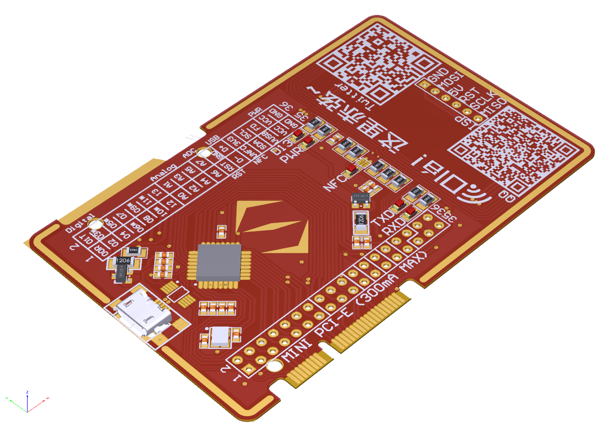
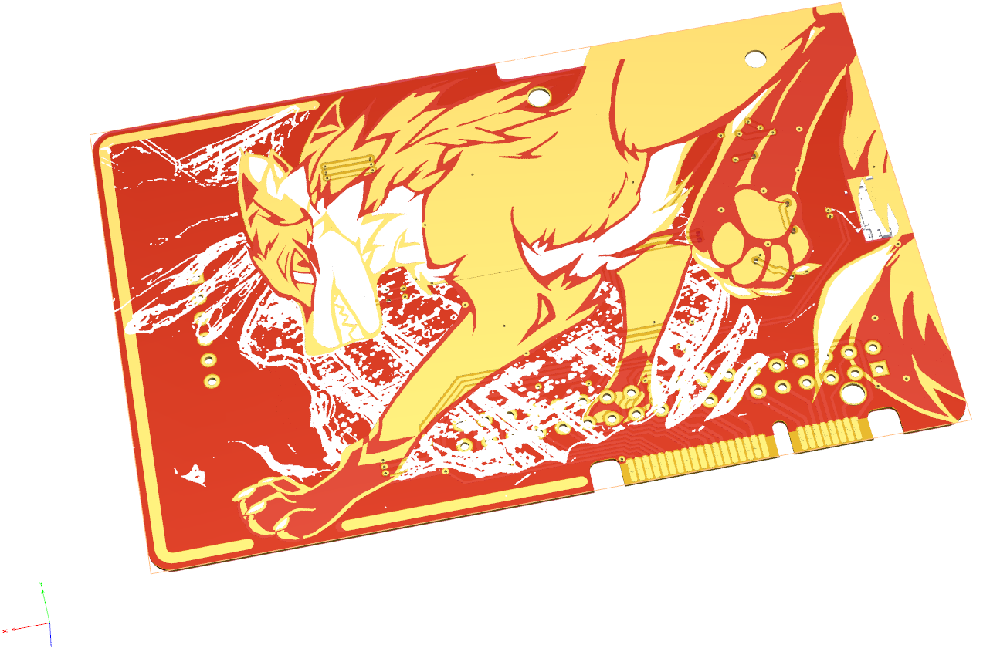

# PCB-business-card

This is a legacy repository storing my PCB business card made in 2020. This business card contains an Arduino nano module and an NFC module. It can be powered by a Micro USB cable or mini-PCIE port. The PCB file is exported into a PDF-3D document. 

